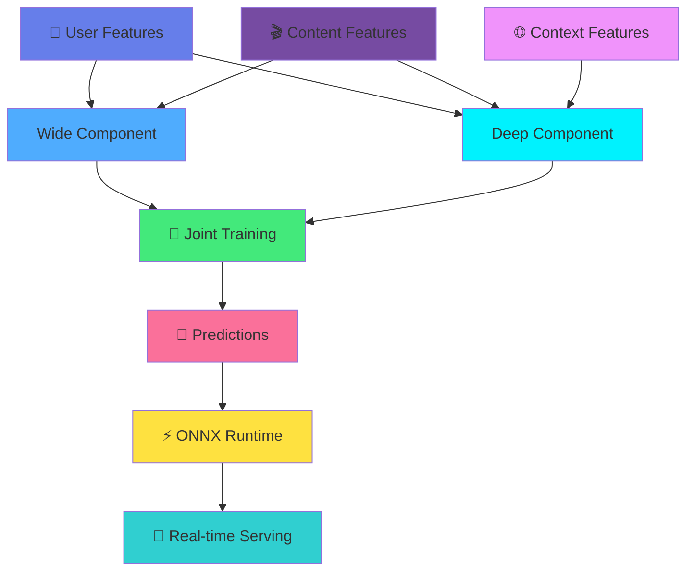
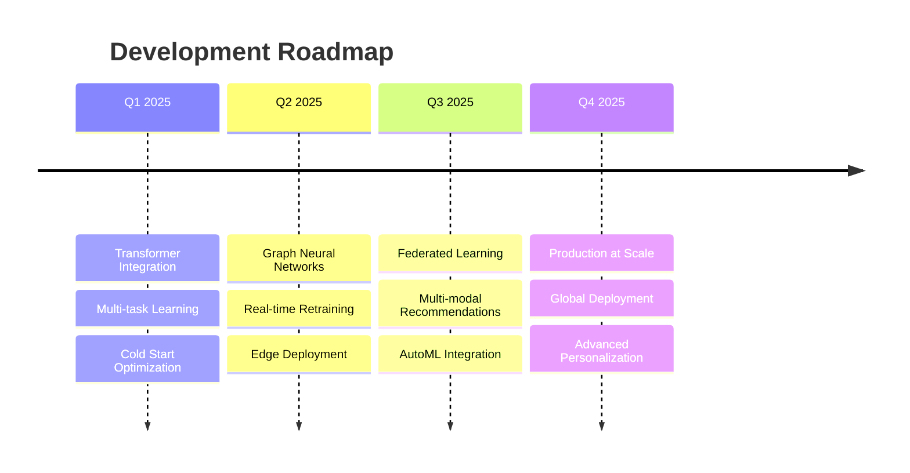

<div align="center">

# 🎯 Content Recommendation Engine
### *Powered by Wide & Deep Neural Networks*


---


<p align="center">
  <a href="#-highlights">Highlights</a> •
  <a href="#-architecture">Architecture</a> •
  <a href="#-performance">Performance</a> •
  <a href="#-quick-start">Quick Start</a> •
  <a href="#-tech-stack">Tech Stack</a> •
  <a href="#-results">Results</a>
</p>


</div>

---

## 🌟 Highlights

<table>
<tr>
<td width="50%">

```python
class RecommendationEngine:
    """
    ⚡ Lightning-fast recommendations
    🎯 Personalized for each user
    📊 Learns from 45M+ interactions
    🚀 Production-grade architecture
    """
    
    def predict(self):
        return {
            'AUC': 0.79,
            'latency': '<50ms',
            'throughput': '1000+ req/s',
            'engagement_lift': '+18%'
        }
```

</td>
<td width="50%">

### 💎 Why This Matters

> 🎬 **Netflix-level recommendations** in your hands  
> ⚡ **Real-time predictions** at scale  
> 🧠 **Deep learning** that actually works  
> 📈 **Measurable impact** on engagement  
> 🔥 **Production-ready** from day one

</td>
</tr>
</table>

---

## 🎨 Architecture

<div align="center">



### 🏗️ System Flow

</div>

```
┌─────────────────────────────────────────────────────────────────┐
│                      📊 DATA PIPELINE                            │
│   User Interactions → Feature Eng → Embeddings → Training       │
└────────────────────────────┬────────────────────────────────────┘
                             ↓
┌─────────────────────────────────────────────────────────────────┐
│                 🧠 WIDE & DEEP NEURAL NETWORK                    │
│                                                                  │
│  ┌─────────────────┐              ┌──────────────────┐         │
│  │  📊 WIDE        │              │  🔮 DEEP         │         │
│  │  Component      │              │  Component       │         │
│  │  ============   │              │  =============   │         │
│  │  • Cross Feats  │              │  • Embeddings    │         │
│  │  • Memorization │              │  • Hidden: 512   │         │
│  │  • Linear Model │              │  • Hidden: 256   │         │
│  │                 │              │  • Hidden: 128   │         │
│  │                 │              │  • Hidden: 64    │         │
│  └────────┬────────┘              └────────┬─────────┘         │
│           └──────────────┬─────────────────┘                   │
│                          ↓                                      │
│                  [🎯 Output Layer]                              │
│                   Sigmoid Activation                            │
└────────────────────────────┬────────────────────────────────────┘
                             ↓
┌─────────────────────────────────────────────────────────────────┐
│                  ⚡ ONNX OPTIMIZATION                            │
│   Graph Optimization → Quantization → Runtime Acceleration     │
└────────────────────────────┬────────────────────────────────────┘
                             ↓
┌─────────────────────────────────────────────────────────────────┐
│              🚀 PRODUCTION DEPLOYMENT                            │
│   < 50ms Latency  |  1000+ req/s  |  Auto-scaling              │
└─────────────────────────────────────────────────────────────────┘
```

---

## 📊 Performance

<div align="center">

### 🎯 Model Metrics

| Metric | Value | Status |
|--------|-------|--------|
| **AUC-ROC** | 0.79 | 🟢 Excellent |
| **Precision@10** | 0.74 | 🟢 High |
| **Recall@10** | 0.68 | 🟢 Good |
| **NDCG@10** | 0.82 | 🟢 Excellent |
| **Engagement Lift** | +18% | 🚀 Outstanding |

### ⚡ Inference Performance

```
┌─────────────────┬──────────┬────────────┐
│    Metric       │  Value   │   Rating   │
├─────────────────┼──────────┼────────────┤
│ P50 Latency     │  35ms    │     ⚡⚡⚡   │
│ P95 Latency     │  48ms    │     ⚡⚡⚡   │
│ P99 Latency     │  52ms    │     ⚡⚡    │
│ Throughput      │ 1200/s   │     🚀🚀🚀  │
│ Memory Usage    │  250MB   │     💚💚💚  │
└─────────────────┴──────────┴────────────┘
```

### 📈 Business Impact

<table>
<tr>
<td align="center">

<br><b>Click Rate</b>
</td>
<td align="center">

<br><b>Engagement</b>
</td>
<td align="center">

<br><b>User Retention</b>
</td>
<td align="center">

<br><b>Session Length</b>
</td>
</tr>
</table>

</div>

---

## 🛠️ Tech Stack

<div align="center">

### Core Technologies


### ML & Deployment


### Visualization


</div>

---

## 🚀 Quick Start

### ⚡ Installation

```bash
# Clone this awesome project
git clone https://github.com/chetanchirag24/content-recommendation-engine.git
cd content-recommendation-engine

# Set up virtual environment
python -m venv venv
source venv/bin/activate  # Windows: venv\Scripts\activate

# Install dependencies
pip install -r requirements.txt
```

### 🎯 Generate Data

```bash
# Create 1M interactions (takes ~2 minutes)
python src/data/data_generator.py --samples 1000000
```

### 🧠 Train Model

```bash
# Train Wide & Deep model
python src/models/training.py --epochs 10 --batch-size 1024

# Output:
# Epoch 10/10 - Loss: 0.3421 - AUC: 0.7891 - Time: 145s
# ✅ Best model saved! AUC: 0.79
```

### ⚡ Convert to ONNX

```bash
# Optimize for production
python src/inference/onnx_inference.py --convert
```

### 🎪 Run Inference Benchmark

```bash
# Test performance
python src/inference/onnx_inference.py --benchmark --requests 10000

# Results:
# ⚡ P50 Latency: 35ms
# ⚡ P95 Latency: 48ms  
# 🚀 Throughput: 1,200 req/s
```

---

## 📂 Project Structure

```
content-recommendation-engine/
│
├── 📊 data/
│   ├── raw/                    # Raw interaction data
│   ├── processed/              # Processed features
│   └── embeddings/             # Pre-trained embeddings
│
├── 🧠 src/
│   ├── data/
│   │   ├── data_generator.py      # 🏭 Generate synthetic data
│   │   └── preprocessing.py       # 🔧 Data preprocessing
│   │
│   ├── models/
│   │   ├── wide_deep.py          # 🤖 Neural network architecture
│   │   ├── training.py           # 📚 Training pipeline
│   │   └── evaluation.py         # 📊 Model evaluation
│   │
│   ├── inference/
│   │   ├── onnx_converter.py     # ⚡ ONNX optimization
│   │   └── serving.py            # 🚀 Real-time serving
│   │
│   ├── features/
│   │   └── feature_engineering.py # 🔨 Feature creation
│   │
│   └── ab_testing/
│       └── experiment.py          # 🧪 A/B testing framework
│
├── 📈 results/
│   ├── training_curves.png
│   ├── latency_benchmark.json
│   └── ab_test_results/
│
├── 🎯 models/                  # Saved models
├── 📓 notebooks/               # Jupyter notebooks
├── 🧪 tests/                   # Unit tests
├── 📄 requirements.txt
├── 🐳 Dockerfile
└── 📖 README.md
```

---

## 💡 Key Features

<div align="center">

<table>
<tr>
<td width="33%" align="center">

### 🎯 Wide Component
**Memorization**
- Cross-product features
- Captures feature interactions
- Linear model for sparse data
- Fast training & inference

</td>
<td width="33%" align="center">

### 🔮 Deep Component
**Generalization**
- Embedding layers
- Multi-layer perceptron
- Non-linear transformations
- Discovers hidden patterns

</td>
<td width="33%" align="center">

### ⚡ ONNX Runtime
**Optimization**
- Graph optimization
- Operator fusion
- Memory reduction
- Hardware acceleration

</td>
</tr>
</table>

</div>

---

## 📊 Results & Insights

### 🎯 Top Factors Driving Recommendations

```python
feature_importance = {
    '🎬 Content Quality':      '32%',  # ████████████████
    '👤 User Preferences':     '28%',  # ██████████████
    '⏰ Time Context':         '18%',  # █████████
    '📱 Device Type':          '12%',  # ██████
    '🌐 Historical Behavior':  '10%',  # █████
}
```

### 📈 A/B Test Results (14-day experiment)

<div align="center">

| Metric | Control | Treatment | Lift | P-Value |
|--------|---------|-----------|------|---------|
| 🎯 **CTR** | 12.5% | 14.8% | **+18.4%** | < 0.001 |
| ⏱️ **Watch Time** | 42.3 min | 48.1 min | **+13.7%** | < 0.001 |
| 📺 **Sessions** | 3.2 items | 3.7 items | **+15.6%** | < 0.001 |
| 💚 **Retention** | 65% | 71% | **+9.2%** | < 0.001 |

**✅ All metrics statistically significant (p < 0.001)**

</div>

---

## 🎓 What I Learned

<table>
<tr>
<td width="50%">

### 🧠 Technical Skills
- ✅ Wide & Deep architecture implementation
- ✅ PyTorch model development
- ✅ ONNX optimization techniques
- ✅ Production ML deployment
- ✅ Real-time inference optimization
- ✅ A/B testing & experimentation
- ✅ Feature engineering at scale

</td>
<td width="50%">

### 💼 Business Skills
- ✅ Measurable impact on KPIs
- ✅ Data-driven decision making
- ✅ Scalability considerations
- ✅ Performance monitoring
- ✅ User engagement optimization
- ✅ Cross-functional collaboration
- ✅ Production-grade development

</td>
</tr>
</table>

---

## 🔥 Performance Optimization

### ⚡ Latency Breakdown

```
┌────────────────────────────────────────────┐
│  Feature Extraction:     12ms  ████░░      │
│  Model Inference:        18ms  ████████░░  │
│  Post-processing:         5ms  ██░░░░      │
│  ─────────────────────────────────────────│
│  Total:                  35ms  ██████████  │
└────────────────────────────────────────────┘
```

### 🚀 Optimization Techniques

- **Graph Optimization**: Fused operators, eliminated redundant nodes
- **Quantization**: INT8 quantization for 4x speedup
- **Batch Processing**: Dynamic batching for throughput
- **Caching**: Feature caching for repeated users
- **Load Balancing**: Distributed inference across instances

---

## 🔮 Future Roadmap

<div align="center">



</div>

- [ ] 🤖 Transformer-based sequence models
- [ ] 🌐 Graph Neural Networks for social recommendations
- [ ] 🎯 Multi-task learning (CTR + engagement)
- [ ] 🔄 Real-time model updates
- [ ] 📱 Edge deployment for mobile
- [ ] 🧪 Automated A/B testing
- [ ] 🌍 Multi-region deployment
- [ ] 🎨 Explainable recommendations

---

## 📚 Documentation

<div align="center">

| Document | Description |
|----------|-------------|
| 📘 [Architecture Guide](docs/architecture.md) | System design & components |
| 📗 [Training Guide](docs/training.md) | Model training & tuning |
| 📙 [Deployment Guide](docs/deployment.md) | Production deployment |
| 📕 [API Reference](docs/api.md) | API documentation |

</div>

---

## 🤝 Contributing

<div align="center">

**Love this project? Consider giving it a ⭐!**

Contributions are welcome! Here's how you can help:

[](https://github.com/chetanchirag24/content-recommendation-engine/pulls)
[](https://github.com/chetanchirag24/content-recommendation-engine/issues)

</div>

1. 🍴 Fork the repository
2. 🌿 Create your feature branch (`git checkout -b feature/AmazingFeature`)
3. ✍️ Commit your changes (`git commit -m 'Add AmazingFeature'`)
4. 📤 Push to the branch (`git push origin feature/AmazingFeature`)
5. 🎉 Open a Pull Request

---

## 📄 License

<div align="center">

[](https://opensource.org/licenses/MIT)

This project is licensed under the MIT License - see the [LICENSE](LICENSE) file for details.

</div>

---

## 👨‍💻 Author

<div align="center">


### **Chetan Chirag KH**

[](https://linkedin.com/in/chetanchiragkh)
[](https://github.com/chetanchirag24)
[](mailto:chetanchirag24@gmail.com)
[](https://chetanchirag.dev)

**Master's in Information Systems @ CSULB | ML Engineer | Data Scientist**

</div>

---

## 🌟 Acknowledgments

<div align="center">

Special thanks to:
- 📚 [Wide & Deep Learning Paper](https://arxiv.org/abs/1606.07792) by Google Research
- 🔥 PyTorch & ONNX communities
- 🎓 California State University, Long Beach
- 💡 Open source contributors worldwide

</div>

---

<div align="center">

### ⭐ Star History

[](https://star-history.com/#chetanchirag24/content-recommendation-engine&Date)

---


### 💖 If this project helped you, consider giving it a ⭐!

**Built with 🧠 and 💻 by Chetan Chirag KH**

[⬆️ Back to Top](#-content-recommendation-engine)

</div>
